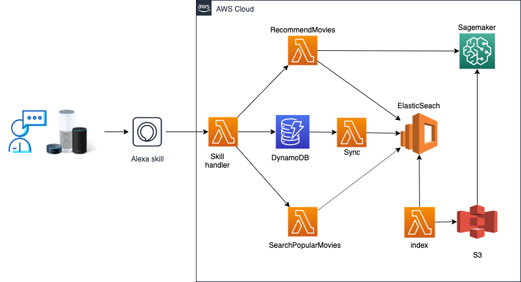

# Smart Movie Recommendation Skill

## Overview 


## Features
- Show most popular movies 
- Recommend movies
- User can rate movies

## Solution Implementation
1. Set up basic Alexa Skill
2. Sagemaker - [Factorisation Machine Algorithm](https://docs.aws.amazon.com/sagemaker/latest/dg/fact-machines.html) - train model and expose endpoint 
3. ElasticSeach - search engine - create a domain to help effectively search in a large group of data
4. DynamoDB - create Users, Movies, Ratings tables
5. Create lambdas function to connect all these services

## Details
### 1. Basic Alexa Skill
Use [ASK-CLI](https://developer.amazon.com/en-US/docs/alexa/smapi/ask-cli-command-reference.html) to initialize a basic alexa skill. 
```
ask new [--url <url> [--template <template name>]] [-n | --skill-name <skill name>][--lambda-name <Lambda function name>] [-p | --profile <profile>][--debug][--help]
```

### 2. Sagemaker
- On AWS SageMaker Console launch a new notebook instance.
- Run the python notebook sagemaker/factorisation_machines.ipynb. Please note this notebook is sourced from https://gitlab.com/juliensimon/dlnotebooks.
- Deploy the sagemaker endpoint

### 3. Elasticsearch
- Create a domain in AWS Elasticsearch
- Download data (http://files.grouplens.org/datasets/movielens/ml-100k/) online and save it in S3
    ``` 
    wget http://files.grouplens.org/datasets/movielens/ml-100k/u.item
    aws s3 cp u.item s3://<yourbucketData>/movies.csv --metadata dataset_id=100KDS,type=movies

    wget http://files.grouplens.org/datasets/movielens/ml-100k/u.user
    aws s3 cp u.user s3://<yourbucketData>/users.csv --metadata dataset_id=100KDS,type=users

    wget http://files.grouplens.org/datasets/movielens/ml-100k/u.data
    aws s3 cp u.data s3://<yourbucketData>/ratings.csv --metadata dataset_id=100KDS,type=ratings
    ```
- Create a lambda called `indexElasticSearch` (Please refer to `lambdas/lambda_elasticsearch_handler.index_handler`) to create index in ES based on the data in S3

Here is the configuration of elasticsearch domain

``` yml
 ElasticsearchDomain:
    Type: AWS::Elasticsearch::Domain
    
    Properties:
      DomainName:
        Ref: elasticSearchDomainName
      ElasticsearchClusterConfig:
        DedicatedMasterEnabled: 'true'
        InstanceCount: '2'
        ZoneAwarenessEnabled: 'true'
        InstanceType: m4.large.elasticsearch
        DedicatedMasterType: m4.large.elasticsearch
        DedicatedMasterCount: '3'
      EBSOptions:
        EBSEnabled: true
        Iops: 0
        VolumeSize: 20
        VolumeType: gp2
      SnapshotOptions:
        AutomatedSnapshotStartHour: '0'
      AdvancedOptions:
        rest.action.multi.allow_explicit_index: 'true'
      AccessPolicies:
        Version: '2012-10-17'
        Statement:
        - Resource:
            Fn::Join:
            - ''
            - - 'arn:aws:es::'
              - Ref: AWS::AccountId
              - ":domain/"
              - Ref: elasticSearchDomainName
              - "/*"
          Principal:
            AWS:
              Fn::Join:
              - ''
              - - 'arn:aws:iam::'
                - Ref: AWS::AccountId
                - ":"
                - root
          Action:
          - es:ESHttp*
          Effect: Allow
        - Effect: Allow
          Principal:
            AWS: "*"
          Action: es:ESHttp*
          Condition:
            IpAddress:
              aws:SourceIp:
              - Ref: yourPublicIpCidr
          Resource:
            Fn::Join:
            - ''
            - - 'arn:aws:es:'
              - Ref: AWS::Region
              - ":"
              - Ref: AWS::AccountId
              - ":domain/"
              - Ref: elasticSearchDomainName
              - "/*"
      Tags:
      - Key: StackName
        Value: 
          Ref: AWS::StackName
```

### 4. DynamoDB
- Create three DynamoDB tables and enable streaming for all
- Create three lambda functions (please refer to `intialize/migration`) to initialize the dynamo tables. Those lambdas basically read data from S3 and save data into DynamoDB.
- Create one additional lambda (please refer to `dynamodbToES`) to sync data in DynamoDB tables with all data in Elasticsearch. This lambda will be triggered automatically when there is any data added, updated or removed from tables. 

### 5. More lambdas
Besides all lambdas mentioned in previous steps, there are three more essential lambdas to be created

- RecommendMovie Lambda: Get all seen movies (suppose all movies rated by the user are seen) from Elasticsearch. Then send all unseen movies list to Sagemaker endpoint. Let sagemaker model give predictions on those movies sorted by score. We recommend top three movies with highest scores.

- SearchPopularMovie Lambda: Search popular movies. Suppose that the more rates the movie gets from users, the more popular it is. 

- Alexa Skill handler lambda: This lambda will be auto generated when deploying the skill. For more details, please refer to folder `skill`.


